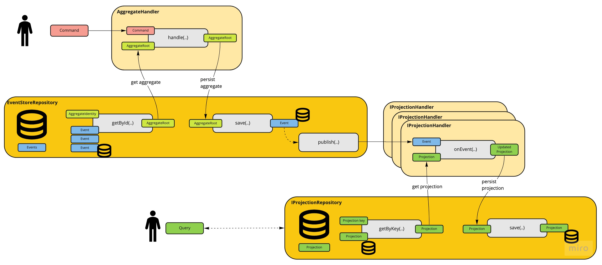

# kotlin-cqrs (Kcqrs)
[](https://github.com/abaddon/kotlin-cqrs/actions/workflows/gradle.yml)
[](https://codecov.io/gh/abaddon/kcqrs-core)

A Kotlin CQRS library based on [C# Muflone library](https://github.com/CQRS-Muflone/Muflone)


### Architecture



### Example
In this example I want to show you how use this library implementing a simple aggregator with the capability to increase a value.

The full example is available [here](https://github.com/abaddon/kcqrs-example)

#### Aggregate - CounterAggregateRoot

```kotlin
data class CounterAggregateRoot private constructor(
    override val id: CounterAggregateId,
    override val version: Long,
    val counter: Int,
    override val uncommittedEvents: MutableCollection<IDomainEvent>
) : AggregateRoot() {
    
    constructor() : this(CounterAggregateId(), 0L, 0, ArrayList<IDomainEvent>())
```

Our aggregate need a costructor with no parameter. It's used by the library to initialise an empty aggregate during the re-hydration.

```kotlin
    fun increaseCounter(incrementValue: Int): CounterAggregateRoot {
        return try {
            check(incrementValue >= 0 && incrementValue < Int.MAX_VALUE) { "Value $incrementValue not valid, it has to be >= 0 and < ${Int.MAX_VALUE}" }
            val updatedCounter = counter + incrementValue
            check(updatedCounter < Int.MAX_VALUE) { "Aggregate value $updatedCounter is not valid, it has to be < ${Int.MAX_VALUE}" }
            raiseEvent(CounterIncreasedEvent(id, incrementValue)) as CounterAggregateRoot
        } catch (e: Exception) {
            raiseEvent(DomainErrorEvent(id, e)) as CounterAggregateRoot
        }
    }
```

The function `increaseCounter(...)` contain the business logic needed to validate the operation required. As you can see the aggregate value is not updated. 

This function raise only a new event `CounterIncreasedEvent`.

```kotlin

    private fun apply(event: CounterIncreasedEvent): CounterAggregateRoot {
        val newCounter = counter + event.value;
        return copy(counter = newCounter, version = version + 1)
    }
}
```

Finally, a private function called `apply(...)` is in charge to receive the event and apply it to the aggregate changing its status.

The event has to be applied without exceptions. All the validations have been executed by the previous function and no more test needed.

:warning: We need an `apply(..)` function for each event managed by the Aggregate. If the aggregate raise an event without its apply method the `HandlerForDomainEventNotFoundException` is raised. 


#### AggregateHandler - CounterAggregateHandler

```kotlin
class CounterAggregateHandler(override val repository: IRepository<CounterAggregateRoot>): AggregateHandler<CounterAggregateRoot>() {
    
    override suspend fun handle(command: ICommand<CounterAggregateRoot>) {
        val currentAggregate = repository.getById(command.aggregateID)
        val updatedAggregate = command.execute(currentAggregate)
        repository.save(updatedAggregate, UUID.randomUUID(), mapOf())
    }
}
```

The AggregateHandler implement only the method `handle(...)`.
The handle method receive a command and perform all the operations needed to allow the command to execute its operation.

In this case the handler load the aggregate reading its id from the command and then the command is executed `command.execute(currentAggregate)`. The output is a new aggregate that will be persisted through the function `save` of the repository.  


#### Command - IncreaseCounterCommand

```kotlin
data class IncreaseCounterCommand(
    override val aggregateID: CounterAggregateId,
    val value: Int
) : Command<CounterAggregateRoot>(aggregateID) {
    override fun execute(currentAggregate: CounterAggregateRoot?): CounterAggregateRoot {
        requireNotNull(currentAggregate)
        return currentAggregate.increaseCounter(value)
    }
}
```

The command implement the function `execute(...)` and it contain the operation that this function has to do on the aggregate.

In this case the command validate if the aggregate is not null and the execute the function `increaseCounter(..)` looked previously.

#### Event - CounterIncreasedEvent

```kotlin
data class CounterIncreasedEvent(
override val messageId: UUID,
override val aggregateId: CounterAggregateId,
override val version: Int = 1,
override val aggregateType: String,
override val header: EventHeader,
val value: Int,
) : IDomainEvent {
constructor(aggregateId: CounterAggregateId, value: Int) : this(UUID.randomUUID(), aggregateId, 1, "CounterAggregateRoot", EventHeader.create("CounterAggregateRoot"),value)
}
```

The event is very simple. It contains only the information needed to update the aggregate status and no business logic is there.

### Advanced features

#### IRouteEvents
Each Aggregate need to define a `IRouteEvents`. The scope of this class is route the events received in the proper way.
The abstract class `AggregateRoot` use the class `ConventionEventRouter` as default.

The class `ConventionEventRouter` automatically map all the aggregate method called `apply` to an event class and when an event has to apply this class know which method has to call.

If we need a different way to apply the events to the aggregate, it's possible to implement a new class using the interface `IRouteEvents` and then use the secondary constructor of the class `AggregateRoot`. 

#### IRepository
We could have multiple repositories and for this reason at the moment this library offers only an interface `IRepository`.
At the moment, [EventStoreDB](https://www.eventstore.com/eventstoredb) is the unique repository implemented and it's available at this link:
[https://github.com/abaddon/kcqrs-EventStoreDB](https://github.com/abaddon/kcqrs-EventStoreDB)